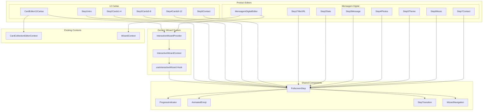

# Design Document: Interactive Wizard Forms

## Overview

Este documento descreve a arquitetura técnica para transformar os formulários dos produtos "12 Cartas" e "Mensagem Digital" em formulários interativos fullscreen, seguindo o padrão já estabelecido pelo produto "Revelação Virtual".

O sistema será construído sobre um componente genérico `InteractiveWizard` que encapsula toda a lógica de navegação, animações e validação, permitindo reutilização entre diferentes produtos com configurações específicas.

### Objetivos Principais

1. Criar um sistema de wizard genérico e reutilizável
2. Migrar os editores existentes para o novo padrão fullscreen
3. Manter compatibilidade total com os contextos e APIs existentes
4. Proporcionar uma experiência imersiva e emocional para os usuários

### Referência de Implementação

O editor de Revelação Virtual (`src/app/(fullscreen)/editor/revelacao-virtual/`) serve como referência principal para o padrão de UX desejado.

## Architecture



### Camadas da Arquitetura

1. **Generic Wizard Layer**: Componentes e contexto genéricos reutilizáveis
2. **Shared Components Layer**: Componentes visuais compartilhados (animações, indicadores)
3. **Product Layer**: Implementações específicas de cada produto
4. **Data Layer**: Contextos existentes que gerenciam dados específicos de cada produto

## Components and Interfaces

### 1. InteractiveWizardContext

```typescript
// src/contexts/InteractiveWizardContext.tsx

interface InteractiveWizardConfig {
  totalSteps: number;
  stepLabels: string[];
  gradientColors: {
    from: string;
    via?: string;
    to: string;
  };
  themeEmojis: string[];
  productType: 'card-collection' | 'digital-message' | 'gender-reveal';
  autoSaveKey: string;
  autoSaveDebounceMs?: number;
}

interface InteractiveWizardState {
  currentStep: number;
  completedSteps: Set<number>;
  stepValidation: Record<number, { isValid: boolean; errors: Record<string, string> }>;
  isNavigating: boolean;
  navigationDirection: 'forward' | 'backward';
}

interface InteractiveWizardContextType {
  // State
  state: InteractiveWizardState;
  config: InteractiveWizardConfig;
  
  // Navigation
  nextStep: () => boolean;
  prevStep: () => void;
  goToStep: (step: number) => boolean;
  canNavigateToStep: (step: number) => boolean;
  
  // Validation
  validateCurrentStep: () => boolean;
  setStepValidation: (step: number, validation: { isValid: boolean; errors: Record<string, string> }) => void;
  
  // Completion
  markStepCompleted: (step: number) => void;
  isStepCompleted: (step: number) => boolean;
  
  // Auto-save
  isSaving: boolean;
  lastSaved: Date | null;
}
```

### 2. InteractiveWizardProvider

```typescript
// src/contexts/InteractiveWizardContext.tsx

interface InteractiveWizardProviderProps {
  children: React.ReactNode;
  config: InteractiveWizardConfig;
  onStepChange?: (step: number, direction: 'forward' | 'backward') => void;
  validateStep?: (step: number) => { isValid: boolean; errors: Record<string, string> };
}

export function InteractiveWizardProvider({
  children,
  config,
  onStepChange,
  validateStep,
}: InteractiveWizardProviderProps): JSX.Element;
```

### 3. FullscreenStep Component

```typescript
// src/components/interactive-wizard/FullscreenStep.tsx

interface FullscreenStepProps {
  children: React.ReactNode;
  emoji?: string;
  title: string;
  subtitle?: string;
  showProgress?: boolean;
  showBackLink?: boolean;
  backLinkHref?: string;
  backLinkText?: string;
  showDemoLink?: boolean;
  demoLinkHref?: string;
  className?: string;
}

export function FullscreenStep({
  children,
  emoji,
  title,
  subtitle,
  showProgress = true,
  showBackLink = true,
  backLinkHref = '/',
  backLinkText = '← Voltar',
  showDemoLink = false,
  demoLinkHref,
  className,
}: FullscreenStepProps): JSX.Element;
```

### 4. ProgressIndicator Component

```typescript
// src/components/interactive-wizard/ProgressIndicator.tsx

interface ProgressIndicatorProps {
  totalSteps: number;
  currentStep: number;
  completedSteps: Set<number>;
  activeColor?: string;
  completedColor?: string;
  pendingColor?: string;
  onStepClick?: (step: number) => void;
  allowClickNavigation?: boolean;
}

export function ProgressIndicator({
  totalSteps,
  currentStep,
  completedSteps,
  activeColor = 'bg-pink-400',
  completedColor = 'bg-pink-300',
  pendingColor = 'bg-gray-300',
  onStepClick,
  allowClickNavigation = true,
}: ProgressIndicatorProps): JSX.Element;
```

### 5. AnimatedEmoji Component

```typescript
// src/components/interactive-wizard/AnimatedEmoji.tsx

interface AnimatedEmojiProps {
  emoji: string;
  delay?: number;
  className?: string;
}

export function AnimatedEmoji({
  emoji,
  delay = 0.1,
  className = 'text-6xl mb-6',
}: AnimatedEmojiProps): JSX.Element;
```

### 6. StepTransition Component

```typescript
// src/components/interactive-wizard/StepTransition.tsx

interface StepTransitionProps {
  children: React.ReactNode;
  stepKey: string | number;
  direction?: 'forward' | 'backward';
}

export function StepTransition({
  children,
  stepKey,
  direction = 'forward',
}: StepTransitionProps): JSX.Element;
```

### 7. WizardNavigation Component

```typescript
// src/components/interactive-wizard/WizardNavigation.tsx

interface WizardNavigationProps {
  onNext?: () => void;
  onPrev?: () => void;
  onFinalize?: () => void;
  isFirstStep?: boolean;
  isLastStep?: boolean;
  isLoading?: boolean;
  nextLabel?: string;
  prevLabel?: string;
  finalizeLabel?: string;
  canProceed?: boolean;
  className?: string;
}

export function WizardNavigation({
  onNext,
  onPrev,
  onFinalize,
  isFirstStep = false,
  isLastStep = false,
  isLoading = false,
  nextLabel = 'Continuar →',
  prevLabel = '← Voltar',
  finalizeLabel = 'Finalizar Compra →',
  canProceed = true,
  className,
}: WizardNavigationProps): JSX.Element;
```

### 8. useInteractiveWizard Hook

```typescript
// src/hooks/useInteractiveWizard.ts

export function useInteractiveWizard(): InteractiveWizardContextType;

// Hooks derivados para casos específicos
export function useWizardNavigation(): {
  currentStep: number;
  totalSteps: number;
  nextStep: () => boolean;
  prevStep: () => void;
  goToStep: (step: number) => boolean;
  isFirstStep: boolean;
  isLastStep: boolean;
};

export function useWizardValidation(): {
  validateCurrentStep: () => boolean;
  setStepValidation: (step: number, validation: { isValid: boolean; errors: Record<string, string> }) => void;
  currentStepErrors: Record<string, string>;
  isCurrentStepValid: boolean;
};
```

## Data Models

### InteractiveWizardConfig Types

```typescript
// src/types/interactive-wizard.ts

export type ProductType = 'card-collection' | 'digital-message' | 'gender-reveal';

export interface GradientConfig {
  from: string;
  via?: string;
  to: string;
}

export interface InteractiveWizardConfig {
  totalSteps: number;
  stepLabels: string[];
  gradientColors: GradientConfig;
  themeEmojis: string[];
  productType: ProductType;
  autoSaveKey: string;
  autoSaveDebounceMs?: number;
}

// Configurações pré-definidas por produto
export const CARD_COLLECTION_CONFIG: InteractiveWizardConfig = {
  totalSteps: 5,
  stepLabels: [
    'Mensagem Inicial',
    'Momentos Difíceis',
    'Momentos de Amor',
    'Momentos Especiais',
    'Dados para Envio',
  ],
  gradientColors: {
    from: 'purple-50',
    via: 'white',
    to: 'pink-50',
  },
  themeEmojis: ['💌', '💔', '💝', '✨', '📧'],
  productType: 'card-collection',
  autoSaveKey: 'card-collection-editor',
  autoSaveDebounceMs: 2000,
};

export const DIGITAL_MESSAGE_CONFIG: InteractiveWizardConfig = {
  totalSteps: 7,
  stepLabels: [
    'Título e URL',
    'Data Especial',
    'Mensagem',
    'Fotos',
    'Tema',
    'Música',
    'Contato',
  ],
  gradientColors: {
    from: 'rose-50',
    via: 'white',
    to: 'amber-50',
  },
  themeEmojis: ['💌', '📅', '💬', '📸', '🎨', '🎵', '📧'],
  productType: 'digital-message',
  autoSaveKey: 'paperbloom-wizard-draft',
  autoSaveDebounceMs: 2000,
};
```

### Animation Configuration

```typescript
// src/types/interactive-wizard.ts

export interface AnimationConfig {
  stepTransition: {
    duration: number;
    enterFrom: { opacity: number; x: number };
    enterTo: { opacity: number; x: number };
    exitTo: { opacity: number; x: number };
  };
  emojiAnimation: {
    initial: { scale: number };
    animate: { scale: number };
    transition: { type: string; damping: number };
  };
  contentStagger: {
    delays: number[];
  };
}

export const DEFAULT_ANIMATION_CONFIG: AnimationConfig = {
  stepTransition: {
    duration: 0.3,
    enterFrom: { opacity: 0, x: 50 },
    enterTo: { opacity: 1, x: 0 },
    exitTo: { opacity: 0, x: -50 },
  },
  emojiAnimation: {
    initial: { scale: 0 },
    animate: { scale: 1 },
    transition: { type: 'spring', damping: 10 },
  },
  contentStagger: {
    delays: [0.1, 0.2, 0.4, 0.5, 0.7],
  },
};
```

### Validation Types

```typescript
// src/types/interactive-wizard.ts

export interface StepValidationResult {
  isValid: boolean;
  errors: Record<string, string>;
}

export type StepValidator = (stepData: unknown) => StepValidationResult;

export interface ValidationConfig {
  validators: Record<number, StepValidator>;
  validateOnChange?: boolean;
  validateOnBlur?: boolean;
}
```

