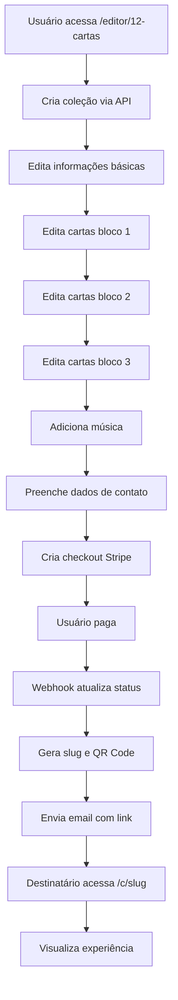

# Arquitetura do Editor de 12 Cartas

## 📋 Visão Geral

O editor `/editor/12-cartas` permite criar uma experiência personalizada de 12 cartas que será visualizada em `/c/[slug]` (página pública) após o pagamento.

## 🎯 Dados do Usuário vs Dados Fixos

### ✏️ Dados Editáveis pelo Usuário

1. **Informações Básicas:**
   - Nome do destinatário (ex: "Maria")
   - Nome do remetente (ex: "João")

2. **Conteúdo das 12 Cartas:**
   - Título de cada carta (pré-preenchido, editável)
   - Mensagem de cada carta (pré-preenchida, editável)
   - Foto de cada carta (opcional, usa imagem genérica se não subir)

3. **Música:**
   - URL do YouTube (opcional)

4. **Dados de Contato (para entrega):**
   - Nome completo
   - Email
   - Telefone

### 🔒 Dados Fixos (Não Editáveis)

1. **Frases Iniciais:**
   - Intro 1: "[Nome do Remetente] preparou 12 cartas para momentos especiais"
   - Intro 2: "Cada carta serve para um momento específico. Abra quando estiver precisando..."

2. **Cores:**
   - Primary: #E6C2C2
   - Secondary: #D4A5A5
   - Background: #FFFAFA
   - Texto: #4A4A4A
   - Texto Secundário: #8B5F5F

3. **Emoji:**
   - ❤️ (coração vermelho)

4. **Estrutura dos Blocos:**
   - Bloco 1: "Para Momentos Difíceis" (cartas 1-4)
   - Bloco 2: "Para Momentos Felizes" (cartas 5-8)
   - Bloco 3: "Para Momentos de Reflexão" (cartas 9-12)

## 🏗️ Arquitetura do Fluxo

### 1. Criação da Coleção

```
POST /api/card-collections/create
Body: {
  recipientName: string,
  senderName: string,
  contactName: string,
  contactEmail: string,
  contactPhone: string
}

Response: {
  collection: CardCollection,
  cards: Card[] // 12 cartas pré-criadas com templates
}
```

### 2. Edição das Cartas

```
PATCH /api/cards/[id]
Body: {
  title?: string,
  message?: string,
  imageUrl?: string
}
```

### 3. Upload de Fotos

```
POST /api/upload/card-image
Body: FormData { image: File }

Response: {
  url: string // URL da imagem no R2
}
```

### 4. Atualização da Coleção

```
PATCH /api/card-collections/[id]
Body: {
  youtubeVideoId?: string
}
```

### 5. Checkout

```
POST /api/checkout/card-collection
Body: {
  collectionId: string
}

Response: {
  sessionId: string,
  url: string // URL do Stripe Checkout
}
```

### 6. Webhook (Após Pagamento)

```
POST /api/checkout/webhook
- Gera slug único
- Gera QR Code
- Atualiza status para 'paid'
- Envia email com link
```

### 7. Visualização Pública

```
GET /c/[slug]
- Carrega dados da coleção
- Renderiza experiência igual à demo
- Sistema de "abrir apenas uma vez"
```

## 📁 Estrutura de Arquivos

```
src/
├── app/
│   ├── (marketing)/
│   │   └── editor/
│   │       └── 12-cartas/
│   │           └── page.tsx          # Editor principal
│   ├── (fullscreen)/
│   │   ├── demo/
│   │   │   └── card-collection/
│   │   │       └── page.tsx          # Demo (já existe)
│   │   └── c/
│   │       └── [slug]/
│   │           └── page.tsx          # Página pública (criar)
│   └── api/
│       ├── card-collections/
│       │   ├── create/route.ts       # Criar coleção (existe)
│       │   └── [id]/route.ts         # Get/Update coleção (existe)
│       ├── cards/
│       │   └── [id]/route.ts         # Update carta (criar)
│       └── upload/
│           └── card-image/route.ts   # Upload imagem (criar)
├── components/
│   └── card-editor/
│       ├── SimpleCardCollectionEditor.tsx  # Novo editor simplificado
│       └── modals/
│           ├── EditCardModal.tsx           # Modal para editar carta
│           └── PhotoUploadModal.tsx        # Modal para upload (existe)
└── types/
    └── card.ts                       # Tipos (já existe)
```

## 🎨 Fluxo do Editor

### Passo 1: Informações Básicas
- Input: Nome do destinatário
- Input: Nome do remetente
- Preview: Mostra como ficará a intro

### Passo 2: Editar Cartas (Bloco 1)
- Grid com 4 cartas (1-4)
- Cada carta mostra:
  - Número da carta
  - Título (editável)
  - Preview da mensagem
  - Botão "Editar"
- Modal de edição:
  - Título
  - Mensagem (textarea)
  - Upload de foto (opcional)
  - Preview da carta

### Passo 3: Editar Cartas (Bloco 2)
- Grid com 4 cartas (5-8)
- Mesmo formato do Passo 2

### Passo 4: Editar Cartas (Bloco 3)
- Grid com 4 cartas (9-12)
- Mesmo formato do Passo 2

### Passo 5: Música e Finalização
- Input: URL do YouTube (opcional)
- Preview do player
- Resumo:
  - Destinatário e remetente
  - Número de cartas com foto
  - Música selecionada
- Botão "Ir para Pagamento"

### Passo 6: Dados de Contato
- Input: Nome completo
- Input: Email
- Input: Telefone
- Botão "Finalizar e Pagar"

## 💾 Schema do Banco de Dados

### Tabela: card_collections

```sql
CREATE TABLE card_collections (
  id UUID PRIMARY KEY,
  recipient_name VARCHAR(100) NOT NULL,
  sender_name VARCHAR(100) NOT NULL,
  slug VARCHAR(255) UNIQUE,
  qr_code_url TEXT,
  status VARCHAR(20) DEFAULT 'pending',
  stripe_session_id VARCHAR(255),
  contact_name VARCHAR(100),
  contact_email VARCHAR(255),
  contact_phone VARCHAR(50),
  youtube_video_id VARCHAR(50),
  created_at TIMESTAMP DEFAULT NOW(),
  updated_at TIMESTAMP DEFAULT NOW()
);
```

### Tabela: cards

```sql
CREATE TABLE cards (
  id UUID PRIMARY KEY,
  collection_id UUID REFERENCES card_collections(id),
  order INT NOT NULL,
  title VARCHAR(200) NOT NULL,
  message_text TEXT NOT NULL,
  image_url TEXT,
  status VARCHAR(20) DEFAULT 'unopened',
  opened_at TIMESTAMP,
  created_at TIMESTAMP DEFAULT NOW(),
  updated_at TIMESTAMP DEFAULT NOW()
);
```

## 🔄 Fluxo Completo



## 📝 Templates Padrão das Cartas

```typescript
const DEFAULT_CARDS = [
  // Bloco 1: Para Momentos Difíceis
  {
    order: 1,
    title: "Quando estiver triste",
    message: "Lembre-se: você é mais forte do que imagina...",
    momentLabel: "Para Momentos Difíceis"
  },
  {
    order: 2,
    title: "Quando precisar de coragem",
    message: "A coragem não é a ausência do medo...",
    momentLabel: "Para Momentos Difíceis"
  },
  {
    order: 3,
    title: "Quando se sentir sozinho(a)",
    message: "Mesmo quando parece que está sozinho...",
    momentLabel: "Para Momentos Difíceis"
  },
  {
    order: 4,
    title: "Quando conquistar algo",
    message: "Parabéns! Cada vitória sua me enche de orgulho...",
    momentLabel: "Para Momentos Difíceis"
  },
  
  // Bloco 2: Para Momentos Felizes
  {
    order: 5,
    title: "Quando estiver feliz",
    message: "Ver você feliz é o meu maior presente...",
    momentLabel: "Para Momentos Felizes"
  },
  // ... (cartas 6-8)
  
  // Bloco 3: Para Momentos de Reflexão
  {
    order: 9,
    title: "Quando precisar de paz",
    message: "Respire fundo. Tudo vai passar...",
    momentLabel: "Para Momentos de Reflexão"
  },
  // ... (cartas 10-12)
];
```

## 🎯 Imagens Genéricas (Fallback)

Se o usuário não fizer upload de foto, usar imagens do Unsplash:

```typescript
const FALLBACK_IMAGES = [
  "https://images.unsplash.com/photo-1518199266791-5375a83190b7?q=80&w=2070",
  "https://images.unsplash.com/photo-1522673607200-1645062cd958?q=80&w=2000",
  "https://images.unsplash.com/photo-1516589178581-6cd7833ae3b2?q=80&w=1974",
  // ... 12 imagens no total
];
```

## 🚀 Próximos Passos

1. ✅ Criar rota `/api/cards/[id]` para atualizar cartas
2. ✅ Criar rota `/api/upload/card-image` para upload de fotos
3. ✅ Criar componente `SimpleCardCollectionEditor`
4. ✅ Criar página `/editor/12-cartas`
5. ✅ Criar página `/c/[slug]` (cópia da demo com dados do banco)
6. ✅ Atualizar webhook para gerar slug e enviar email
7. ✅ Testar fluxo completo

---

**Criado em:** 10/01/2025
**Versão:** 1.0.0
